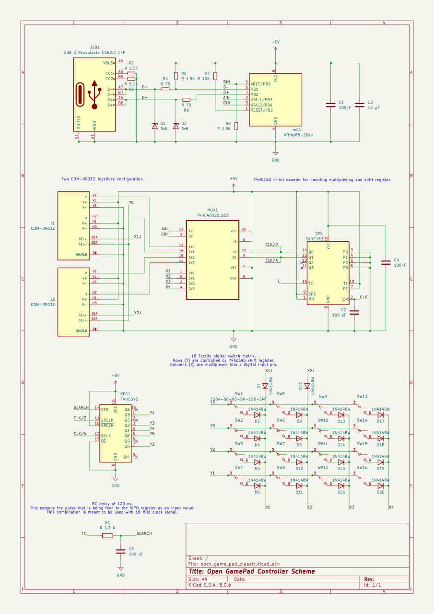

# Open Game Pad

Low-cost, DIY game controller. This project enables anyone to build a custom game pad using affordable components and open hardware principles. The repository contains all necessary files, including PCB designs and firmware.

## Contents
- `pcb/`: PCB design files
- `src/`: Firmware source code
- `usbdrv/`: USB driver files
- `docs/`: Images

## Images

